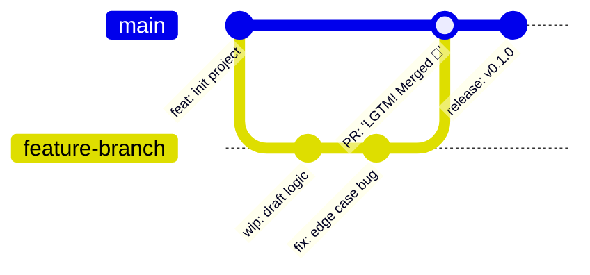
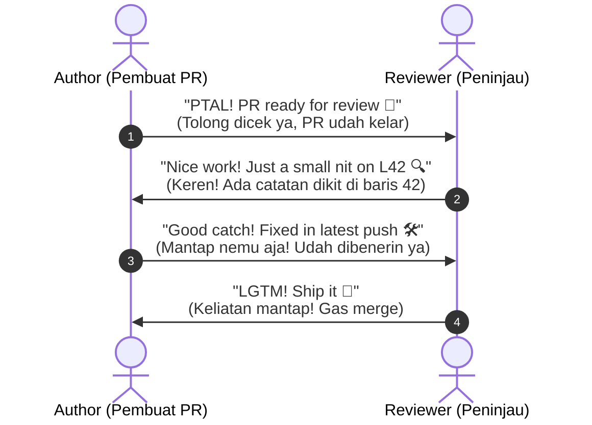

# GitHub Communication & Workflow Guide
## Panduan Komunikasi Kasual GitHub (Bilingual: English & Bahasa Indonesia)

Dokumen ini berisi panduan gaya bahasa, alur kerja (workflow), dan kamus frasa kasual yang lazim digunakan oleh software engineer dalam kolaborasi proyek open-source di GitHub.

---

## 📊 1. Diagram Alur Siklus Kerja GitHub (Workflow Lifecycle)

### Alur Komunikasi Pull Request & Code Review

---

## 📑 2. Tabel Data Lengkap: Frasa GitHub (Inggris vs Indonesia Santai)

### A. Pull Request (PR) & Code Review

| Konteks / Situasi | English (Casual Dev) | Bahasa Indonesia (Casual Dev) |
| :--- | :--- | :--- |
| **Membuka PR baru** | *"Hey folks, this PR tackles the auth bug. Feel free to take a look!"* | *"Halo gaes, PR ini buat fix bug auth ya. Boleh tolong dicek!"* |
| **Menyetujui PR** | *"LGTM! Clean work, merging this now."* | *"Aman nih, rapi kodenya. Langsung gue merge ya!"* |
| **Catatan minor (tidak wajib)** | *"Looks solid! Small nit: we can inline this variable."* | *"Udah oke banget! Nit dikit: variabel ini bisa di-inline aja."* |
| **Menemukan bug/kekurangan** | *"Good catch, but this might break on edge cases."* | *"Bagus sih, tapi kayaknya bakal error pas kena case ini deh."* |
| **Merespon masukan review** | *"Nice spot! Updated in the latest commit."* | *"Mantap nemu aja! Udah di-update di commit barusan ya."* |
| **Meminta review ulang** | *"Addressed all comments. Ready for another pass!"* | *"Semua feedback udah diberesin ya. Boleh dicek lagi!"* |
| **Masih dalam pengerjaan** | *"WIP: Still ironing out some kinks, don't merge yet."* | *"Masih WIP ya, lagi beresin logic-nya, jangan dimerge dulu."* |

---

### B. Issues & Troubleshooting

| Konteks / Situasi | English (Casual Dev) | Bahasa Indonesia (Casual Dev) |
| :--- | :--- | :--- |
| **Lapor Bug Awal** | *"Hey there, ran into a weird crash on startup..."* | *"Halo, nemu error aneh pas aplikasi baru nyala nih..."* |
| **Menanyakan kelanjutan** | *"Just checking in on this one, any updates?"* | *"Nanya dong, ada update buat issue ini kah?"* |
| **Konfirmasi sudah sembuh** | *"Works like a charm now, thanks a ton!"* | *"Udah jalan lancar jaya sekarang, makasih banyak ya!"* |
| **Tidak bisa mereproduksi bug** | *"Can't repro on my end. Could you share your OS/logs?"* | *"Di tempat gue ga muncul errornya. Boleh share spek OS/lognya?"* |
| **Menutup issue yang selesai** | *"Fixed via #42, closing this out."* | *"Udah beres di PR #42, issue-nya gue tutup ya."* |
| **Issue sudah basi/tidak relevan** | *"Closing this as it's stale/no longer reproducible."* | *"Gue close ya karena udah kelamaan / ga kejadian lagi."* |

---

### C. Pesan Commit (Git Commits)

| Tipe Commit | Format English Casual | Penjelasan Bahasa Indonesia Santai |
| :--- | :--- | :--- |
| **Fix Bug Cepat** | `fix: quick fix for off-by-one error` | Benerin bug tipis salah hitung index |
| **Rapi-rapi Kode** | `refactor: clean up messy helper logic` | Bersih-bersih kodingan helper yang berantakan |
| **Hapus yang Ga Perlu** | `chore: drop dead code & unused imports` | Buang kode mati sama import yang ga kepake |
| **Update Docs** | `docs: fix typo in README & polish setup steps` | Benerin typo di README & rapihin step instalasi |
| **Tweak Performa** | `perf: speed up polynomial multiplication loop` | Naikin performa loop perkalian polinomial |
| **Fix Darurat** | `fix: hotfix panic on invalid ciphertext` | Benerin crash darurat pas dapet ciphertext ngaco |

---

## 📚 3. Kamus Singkatan & Slang Developer Populer

| Singkatan / Slang | Kepanjangan | Arti & Penggunaan Kasual |
| :---: | :--- | :--- |
| **LGTM** | *Looks Good To Me* | "Udah oke banget di gue, gas merge!" |
| **SGTM** | *Sounds Good To Me* | "Cocok / gue setuju sama ide lo." |
| **PTAL** | *Please Take A Look* | "Tolong intip/cek sebentar dong." |
| **Nit / Nitpick** | *Small trivial detail* | Catatan sepele (misal typo, spasi, nama variabel). |
| **WIP** | *Work In Progress* | "Masih dikerjain, belum selesai." |
| **TL;DR** | *Too Long; Didn't Read* | Ringkasan singkat inti pembicaraan. |
| **Bump** | *Bring Up My Post* | "Nyundul" issue/PR biar kebaca lagi. |
| **WDYT** | *What Do You Think?* | "Menurut lo gimana?" |
| **Repro** | *Reproduce* | Mereplikasi / memunculkan ulang bug. |
| **Ship it** | *Deploy / Release / Merge* | "Gas rilis / langsung naikin ke production!" |
| **ACK / NACK** | *Acknowledge / Not Acknowledged* | "Paham/Setuju" vs "Ga setuju/Ada kendala". |

---

## 🏷️ 4. Template Deskripsi Repositori (Repo Bio & Tagline)

- **Versi 1 (Minimalis & Cepat)**:
  > *🇬🇧 "Blazing-fast post-quantum crypto toolkit in pure Rust. Zero fluff, 100% clean-room."*  
  > *🇮🇩 "Toolkit kripto post-quantum super kenceng pake Rust murni. Tanpa ribet, 100% rapi."*

- **Versi 2 (Developer-First)**:
  > *🇬🇧 "A no-nonsense hybrid KEM & signature engine built for high assurance."*  
  > *🇮🇩 "Engine hybrid KEM & signature yang to the point dan fokus di keamanan tingkat tinggi."*
